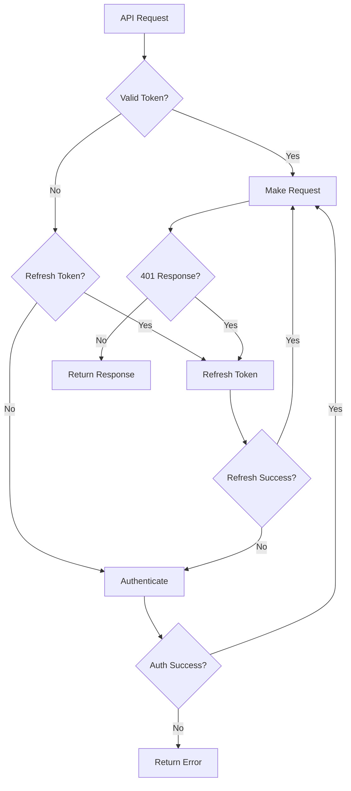

# JWT Implementation for DRF Backend Integration

## Overview
This document describes the JWT (JSON Web Token) implementation for connecting PrimeSync to a Django REST Framework backend. The implementation follows DRY principles and best practices for secure authentication.

## 🔐 JWT Token Management

### JWTTokenManager Class
The `JWTTokenManager` class handles JWT access and refresh tokens with automatic refresh capabilities.

#### Key Features:
- **Automatic Token Refresh**: Refreshes access tokens 5 minutes before expiry
- **Token Validation**: Checks token validity before use
- **Secure Storage**: Tokens are stored in memory only (not persisted)
- **Error Handling**: Graceful handling of expired/invalid tokens

#### Methods:
```python
class JWTTokenManager:
    def set_tokens(self, access_token: str, refresh_token: str, expires_in: int = 3600)
    def get_valid_access_token(self) -> Optional[str]
    def get_refresh_token(self) -> Optional[str]
    def clear_tokens(self)
    def is_token_valid(self) -> bool
```

### Token Lifecycle:
1. **Authentication**: User credentials → JWT access + refresh tokens
2. **Usage**: Access token used for API requests
3. **Refresh**: Automatic refresh when token expires (5 min before)
4. **Re-authentication**: Fresh login if refresh token expires

## 🔗 API Client Integration

### APIClient Class Enhancements
The `APIClient` class has been enhanced with JWT authentication capabilities.

#### New Methods:
- `_authenticate_with_jwt()`: Authenticates with DRF backend
- `_refresh_jwt_token()`: Refreshes expired access tokens
- `_get_valid_jwt_token()`: Gets valid token (authenticates/refreshes as needed)
- `_make_authenticated_request()`: Makes authenticated API requests
- `test_connection()`: Tests connection with JWT authentication

### Authentication Flow:


## 🌐 DRF Backend Endpoints

### Required Endpoints:
The DRF backend must implement the following endpoints:

#### 1. JWT Token Endpoint
```
POST /api/token/
Content-Type: application/json

{
    "username": "user@example.com",
    "password": "password123"
}

Response:
{
    "access": "eyJ0eXAiOiJKV1QiLCJhbGciOiJIUzI1NiJ9...",
    "refresh": "eyJ0eXAiOiJKV1QiLCJhbGciOiJIUzI1NiJ9...",
    "expires_in": 3600
}
```

#### 2. JWT Refresh Endpoint
```
POST /api/token/refresh/
Content-Type: application/json

{
    "refresh": "eyJ0eXAiOiJKV1QiLCJhbGciOiJIUzI1NiJ9..."
}

Response:
{
    "access": "eyJ0eXAiOiJKV1QiLCJhbGciOiJIUzI1NiJ9...",
    "expires_in": 3600
}
```

#### 3. Institute Info Endpoint
```
GET /api/institute/{institute_id}/info/
Authorization: Bearer <access_token>

Response:
{
    "id": 1,
    "name": "Example Institute",
    "code": "EI001",
    "status": "active"
}
```

#### 4. Attendance Endpoint
```
POST /api/attendance/
Authorization: Bearer <access_token>
Content-Type: application/json

{
    "attendance": [
        {
            "user_id": "12345",
            "timestamp": "2024-01-15T09:30:00Z",
            "status": "check_in",
            "punch": 1,
            "uid": "12345"
        }
    ]
}

Response:
{
    "success": true,
    "message": "Attendance data saved successfully",
    "count": 1
}
```

## 🔧 Configuration

### Settings Requirements:
The following settings must be configured in PrimeSync:

```python
DEFAULT_SETTING = {
    "cloud_api_url": "https://api.example.com",  # Base URL
    "username": "user@example.com",              # DRF username
    "password": "encrypted_password",            # Encrypted password
    "institute_id": "123",                       # Institute ID
    "in_time_process": "09:00",                  # Optional
    "out_time_process": "17:00",                 # Optional
}
```

### Environment Variables:
```bash
# Optional: Override master key for encryption
export PRIMESYNC_MASTER_KEY="your-secure-master-key"
```

## 🛡️ Security Features

### 1. Token Security:
- **No Persistence**: Tokens stored in memory only
- **Automatic Expiry**: Tokens expire automatically
- **Secure Transmission**: HTTPS required for all API calls
- **Bearer Authentication**: Standard JWT Bearer token format

### 2. Error Handling:
- **Graceful Degradation**: Falls back to re-authentication on token expiry
- **Clear Error Messages**: Specific error types for different failures
- **Logging**: Comprehensive logging for debugging
- **User Feedback**: Clear notifications for connection status

### 3. Input Validation:
- **URL Validation**: Ensures valid API URLs
- **Credential Validation**: Validates username/password format
- **Institute ID Validation**: Ensures valid institute ID format

## 📋 Usage Examples

### 1. Testing Connection:
```python
# In dashboard GUI
success = self.api_client.test_connection(
    url="https://api.example.com",
    username="user@example.com", 
    password="password123",
    institute_id="123"
)
```

### 2. Posting Attendance Data:
```python
# Automatic JWT handling
self.api_client.post_to_cloud()
```

### 3. Manual Authentication:
```python
# Get valid token
token = self.api_client._get_valid_jwt_token(
    url="https://api.example.com",
    username="user@example.com",
    password="password123"
)
```

## 🔄 DRY Principles Implementation

### 1. Single Responsibility:
- `JWTTokenManager`: Handles only token operations
- `APIClient`: Handles only API communication
- `DashboardGUI`: Handles only UI interactions

### 2. Code Reuse:
- `_make_authenticated_request()`: Used by all API calls
- `_get_valid_jwt_token()`: Centralized token management
- `_authenticate_with_jwt()`: Reused for initial auth and re-auth

### 3. Configuration Management:
- Centralized API endpoints in `core/constants.py`
- Reusable settings validation
- Consistent error handling patterns

## 🧪 Testing

### Test Scenarios:
1. **Successful Authentication**: Valid credentials → JWT tokens
2. **Token Refresh**: Expired access token → Automatic refresh
3. **Re-authentication**: Expired refresh token → Fresh login
4. **Network Errors**: Connection failures → Proper error handling
5. **Invalid Credentials**: Wrong username/password → Clear error
6. **API Errors**: Server errors → Graceful degradation

### Test Endpoints:
```python
# Test connection
api_client.test_connection(url, username, password, institute_id)

# Test token refresh
api_client._refresh_jwt_token(url)

# Test authenticated request
api_client._make_authenticated_request("GET", url)
```

## 🚀 Best Practices

### 1. Security:
- ✅ HTTPS for all API communications
- ✅ No token persistence in files
- ✅ Automatic token refresh
- ✅ Clear error handling
- ✅ Input validation

### 2. Performance:
- ✅ Token caching in memory
- ✅ Minimal API calls
- ✅ Efficient error recovery
- ✅ Connection pooling (via requests)

### 3. Maintainability:
- ✅ Clear separation of concerns
- ✅ Comprehensive logging
- ✅ Type hints and documentation
- ✅ Consistent error handling

### 4. User Experience:
- ✅ Clear error messages
- ✅ Automatic retry logic
- ✅ Progress notifications
- ✅ Graceful degradation

## 📝 Error Handling

### Exception Types:
```python
class APIAuthenticationError(PrimeSyncError):
    """Raised when JWT authentication fails"""

class APINetworkError(PrimeSyncError):
    """Raised when network issues occur"""

class APICallError(PrimeSyncError):
    """Raised when API calls fail"""
```

### Error Recovery:
1. **Network Errors**: Retry with exponential backoff
2. **Auth Errors**: Clear tokens and re-authenticate
3. **Token Expiry**: Automatic refresh or re-authentication
4. **Server Errors**: Graceful degradation with user notification

## 🔮 Future Enhancements

### Potential Improvements:
1. **Token Persistence**: Secure token storage for offline capability
2. **Rate Limiting**: Implement API rate limiting
3. **Caching**: Cache institute/user data
4. **WebSocket**: Real-time updates
5. **OAuth2**: Support for OAuth2 authentication
6. **API Versioning**: Support for multiple API versions

---

**Summary**: The JWT implementation provides secure, efficient, and maintainable authentication for PrimeSync's DRF backend integration, following DRY principles and industry best practices. 